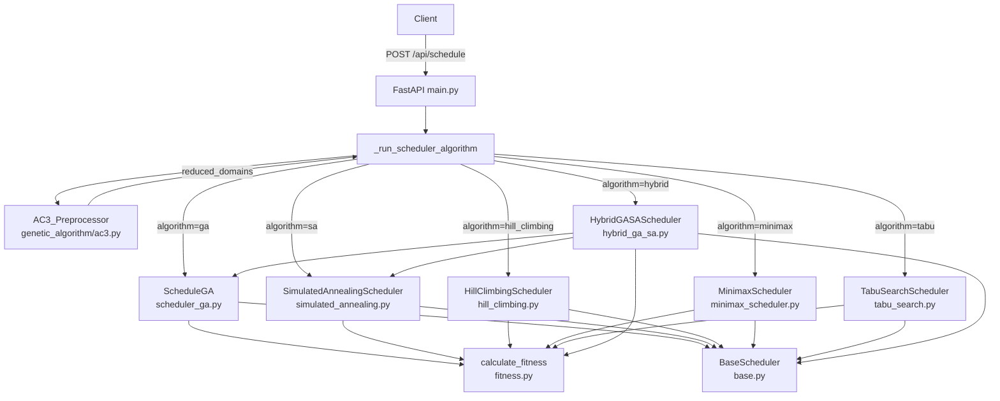

# Design Document — AI Algorithm Improvements

## Overview

This document describes the technical design for upgrading the AI optimization layer of the Smart Scheduler system. The system schedules university courses by minimizing a penalty-based fitness function using metaheuristic algorithms.

The improvements span five areas:

1. **GA enhancements** — diverse crossover strategies (OX, uniform), adaptive mutation rate, constraint repair, and early stopping.
2. **SA enhancements** — adaptive cooling schedule and swap-based neighbor generation.
3. **New algorithms** — Tabu Search (`tabu_search.py`) and Hybrid GA+SA (`hybrid_ga_sa.py`).
4. **AC-3 preprocessing** — constraint propagation to shrink search domains before optimization.
5. **Fitness improvements** — triple-consecutive penalty, instructor conflict penalty, and configurable `PenaltyConfig`.

All changes are backward-compatible with the existing `ScheduleInput` schema and `_run_scheduler_algorithm` dispatcher. Every algorithm inherits `BaseScheduler` and delegates penalty evaluation exclusively to `calculate_fitness()` in `genetic_algorithm/fitness.py`.

---

## Architecture



**Key architectural constraints:**
- `calculate_fitness()` is the single source of truth for all penalty logic. No algorithm may re-implement penalty rules.
- All schedulers inherit `BaseScheduler` and receive `reduced_domains` from AC-3 when `use_ac3=True`.
- The dispatcher (`_run_scheduler_algorithm`) is the only entry point for algorithm selection.

---

## Components and Interfaces

### BaseScheduler (updated)

```python
class BaseScheduler:
    def __init__(
        self,
        subjects: List[str],
        time_slots: List[str],
        constraints: Dict[str, List[str]],
        *,
        priorities: Dict[str, int] | None = None,
        additional_constraints: Dict[str, Any] | None = None,
        subject_details: Dict[str, Any] | None = None,
        reduced_domains: Dict[str, List[int]] | None = None,  # NEW
    ): ...

    def _effective_slots(self, subject: str) -> List[int]:
        """Returns reduced_domains[subject] if available and non-empty,
        otherwise falls back to range(num_slots)."""
        ...

    def run(self) -> Tuple[List[dict], float]: ...
```

The new `_effective_slots(subject)` helper centralizes domain selection so all subclasses benefit from AC-3 without duplicating logic.

---

### AC3_Preprocessor (new — `genetic_algorithm/ac3.py`)

```python
def run_ac3(
    subjects: List[str],
    time_slots: List[str],
    constraints: Dict[str, List[str]],
) -> Dict[str, List[int]]:
    """
    Returns reduced_domains: subject -> list of valid slot indices.
    Removes any slot index whose name appears in constraints[subject].
    Falls back to full domain if result would be empty.
    """
```

**Algorithm:**
1. For each subject, start with domain = `list(range(len(time_slots)))`.
2. For each forbidden slot name in `constraints[subject]`, remove the corresponding index from the domain.
3. If domain becomes empty, restore full domain and emit a warning log.
4. Return the mapping.

This is a simplified AC-3 (arc consistency) that handles unary constraints (per-subject forbidden slots). Full binary arc propagation between subjects is out of scope for this iteration.

---

### ScheduleGA (updated — `genetic_algorithm/scheduler_ga.py`)

New parameters added to `ScheduleGA.__init__`:

| Parameter | Type | Default | Description |
|---|---|---|---|
| `crossover_strategy` | `str` | `"order_crossover"` | `"single_point"`, `"order_crossover"`, `"uniform_crossover"` |
| `base_mutation_rate` | `float` | `0.1` | Starting mutation probability |
| `max_mutation_rate` | `float` | `0.5` | Upper bound on mutation rate |
| `mutation_step` | `float` | `0.05` | Increment when stagnating |
| `stagnation_threshold` | `int` | `20` | Generations without improvement before boosting mutation |
| `early_stopping_patience` | `int` | `30` | Generations without improvement before stopping |

**Crossover methods:**

```python
def _single_point_crossover(self, p1, p2) -> Tuple[List[int], List[int]]: ...
def _order_crossover(self, p1, p2) -> Tuple[List[int], List[int]]: ...
def _uniform_crossover(self, p1, p2) -> Tuple[List[int], List[int]]: ...
def crossover(self, p1, p2) -> Tuple[List[int], List[int]]: ...  # dispatches
```

**OX (Order Crossover) algorithm:**
1. Choose a random contiguous segment `[start, end)` from `parent1`.
2. Copy that segment into the child at the same positions.
3. Fill remaining positions left-to-right with values from `parent2` that are not already in the child segment.
4. Since slot indices can repeat (multiple subjects can share a slot), OX is adapted: the segment is copied verbatim, and remaining positions are filled from `parent2` in order, preserving all values.

**Constraint repair:**

```python
def _constraint_repair(self, individual: List[int]) -> List[int]: ...
```

After mutation, scan for duplicate slot assignments. For each duplicate, find the nearest unused slot index (scanning outward from the current index). If no unused slot exists, leave the gene unchanged. The repair never introduces out-of-range indices.

**Adaptive mutation:**

```python
def _adaptive_mutate(self, individual: List[int]) -> List[int]: ...
```

Uses `self._current_mutation_rate` which is updated each generation:
- If `stagnation_counter > stagnation_threshold`: `rate = min(rate + mutation_step, max_mutation_rate)`
- If best score improved: `rate = base_mutation_rate`, `stagnation_counter = 0`

---

### SimulatedAnnealingScheduler (updated — `genetic_algorithm/simulated_annealing.py`)

New parameters:

| Parameter | Type | Default | Description |
|---|---|---|---|
| `cooling_strategy` | `str` | `"adaptive"` | `"geometric"` or `"adaptive"` |
| `alpha_fast` | `float` | `0.99` | Cooling factor when acceptance rate is high |
| `alpha_slow` | `float` | `0.999` | Cooling factor when acceptance rate is low |
| `target_acceptance_rate` | `float` | `0.4` | Threshold for switching cooling speed |
| `acceptance_window` | `int` | `100` | Window size for computing acceptance rate |
| `neighbor_strategy` | `str` | `"mixed"` | `"single_gene"`, `"swap"`, or `"mixed"` |

**Adaptive cooling logic:**

```python
def _update_temperature(self, accepted: bool) -> None:
    self._acceptance_history.append(1 if accepted else 0)
    if len(self._acceptance_history) > self.acceptance_window:
        self._acceptance_history.pop(0)
    if self.cooling_strategy == "adaptive":
        rate = sum(self._acceptance_history) / len(self._acceptance_history)
        alpha = self.alpha_fast if rate > self.target_acceptance_rate else self.alpha_slow
    else:
        alpha = self.alpha
    self.T = max(self.T * alpha, self.T_min)
```

Temperature is guaranteed non-increasing because `alpha <= 1` and `T_min > 0`.

**Neighbor strategies:**

```python
def _single_gene_neighbor(self, solution: List[int]) -> List[int]: ...
def _swap_neighbor(self, solution: List[int]) -> List[int]: ...
def _random_neighbor(self, solution: List[int]) -> List[int]: ...  # dispatches
```

---

### TabuSearchScheduler (new — `genetic_algorithm/tabu_search.py`)

```python
class TabuSearchScheduler(BaseScheduler):
    def __init__(
        self,
        subjects, time_slots, constraints,
        *,
        priorities=None,
        additional_constraints=None,
        subject_details=None,
        reduced_domains=None,
        tenure: int = 10,
        max_iter: int = 1000,
    ): ...

    def run(self) -> Tuple[List[dict], float]: ...
```

**Algorithm:**
1. Initialize with a random solution.
2. At each step, generate all single-gene moves (change one subject's slot to any other slot in its effective domain).
3. Select the best non-tabu move. If a tabu move has cost lower than the global best (aspiration criterion), allow it.
4. If all moves are tabu and no aspiration criterion is met, select the lowest-cost tabu move.
5. Execute the selected move, add it to the tabu list (FIFO, max size = `tenure`).
6. Update global best if improved.
7. Repeat for `max_iter` steps.

**Tabu list representation:** A `collections.deque(maxlen=tenure)` storing `(subject_index, new_slot_index)` tuples. This bounds memory and provides O(1) FIFO eviction.

---

### HybridGASAScheduler (new — `genetic_algorithm/hybrid_ga_sa.py`)

```python
class HybridGASAScheduler(BaseScheduler):
    def __init__(
        self,
        subjects, time_slots, constraints,
        *,
        priorities=None,
        additional_constraints=None,
        subject_details=None,
        reduced_domains=None,
        ga_generations: int = 100,
        sa_interval: int = 20,
        top_k: int = 5,
        sa_max_iter: int = 500,
    ): ...

    def run(self) -> Tuple[List[dict], float, List[dict]]: ...
```

**Algorithm:**
1. Run GA for `ga_generations` generations using the updated `ScheduleGA`.
2. Every `sa_interval` generations, extract the `top_k` best individuals from the current GA population.
3. For each of the `top_k` individuals, run SA local search for `sa_max_iter` steps starting from that individual.
4. Replace the corresponding GA population members with the SA-improved individuals if SA found a better solution.
5. Continue GA from the updated population.
6. Return the best solution found across all GA generations and SA phases.

**Convergence log format:**
```json
[
  {"phase": "ga", "generation": 10, "cost": 450.0},
  {"phase": "sa", "generation": 20, "individual": 0, "cost": 380.0},
  ...
]
```

---

### PenaltyConfig (new — `schemas.py`)

```python
class PenaltyConfig(BaseModel):
    slot_collision_high: float = Field(default=1000.0, ge=0)
    slot_collision_low: float = Field(default=1500.0, ge=0)
    forbidden_slot_base: float = Field(default=500.0, ge=0)
    unavailable_slot_base: float = Field(default=800.0, ge=0)
    consecutive_day_penalty: float = Field(default=200.0, ge=0)
    day_imbalance_factor: float = Field(default=50.0, ge=0)
    afternoon_penalty: float = Field(default=100.0, ge=0)
    saturday_penalty: float = Field(default=300.0, ge=0)
    triple_consecutive_penalty: float = Field(default=300.0, ge=0)
    instructor_conflict_penalty: float = Field(default=800.0, ge=0)
```

The `ge=0` validator on every field ensures HTTP 422 is returned automatically by FastAPI/Pydantic when a negative value is submitted.

**ScheduleInput additions:**

```python
class ScheduleInput(BaseModel):
    # ... existing fields ...
    penalty_config: Optional[PenaltyConfig] = None   # NEW
    use_ac3: bool = True                              # NEW
```

---

### calculate_fitness (updated — `genetic_algorithm/fitness.py`)

New signature:

```python
def calculate_fitness(
    *,
    subjects: List[str],
    time_slots: List[str],
    constraints: Dict[str, List[str]],
    individual: List[int],
    priorities: Dict[str, int] | None = None,
    additional_constraints: Dict[str, Any] | None = None,
    subject_details: Dict[str, Any] | None = None,
    penalty_config: "PenaltyConfig | None" = None,   # NEW
) -> float: ...
```

When `penalty_config` is `None`, a default `PenaltyConfig()` instance is used internally, preserving full backward compatibility.

**New penalty rules added:**

*Triple consecutive (Constraint 8):*
```python
if additional_constraints.get("avoidTripleConsecutive", False):
    # Group slots by day, sort by period order (Sáng < Chiều < Tối)
    # For each day with 3+ subjects, count groups of 3 consecutive periods
    # Add triple_consecutive_penalty per group
```

*Instructor conflict (Constraint 9):*
```python
# Build instructor -> [slot_indices] map from subject_details
# For each instructor with 2+ subjects in same slot, add instructor_conflict_penalty per pair
```

---

### Dispatcher (updated — `main.py`)

```python
def _run_scheduler_algorithm(
    algorithm: str,
    subject_names, time_slots, constraints, priorities,
    additional_constraints, subject_details,
    penalty_config=None,   # NEW
    use_ac3: bool = True,  # NEW
):
    # Step 1: AC-3 preprocessing
    reduced_domains = None
    if use_ac3:
        from genetic_algorithm.ac3 import run_ac3
        reduced_domains = run_ac3(subject_names, time_slots, constraints)

    algo = (algorithm or "ga").strip().lower()
    common_kwargs = dict(
        priorities=priorities,
        additional_constraints=additional_constraints,
        subject_details=subject_details,
        reduced_domains=reduced_domains,
        penalty_config=penalty_config,
    )

    if algo == "ga":      return _run_ga(**common_kwargs)
    if algo == "sa":      return _run_sa(**common_kwargs)
    if algo == "hill_climbing": return _run_hc(**common_kwargs)
    if algo == "minimax": return _run_minimax(**common_kwargs)
    if algo == "tabu":    return _run_tabu(**common_kwargs)    # NEW
    if algo == "hybrid":  return _run_hybrid(**common_kwargs)  # NEW
    raise HTTPException(400, "algorithm không hợp lệ (ga | hill_climbing | sa | minimax | tabu | hybrid)")
```

---

## Data Models

### Solution encoding (unchanged)

A solution is `List[int]` of length `num_subjects`. `individual[i]` is the index into `time_slots` for `subjects[i]`. This encoding is shared by all algorithms.

### Convergence log

All algorithms that return a convergence log use this schema:

```python
# GA / Hybrid GA phase
{"generation": int, "cost": float, "stopped_early": bool}  # stopped_early only when True

# SA / Hybrid SA phase
{"iteration": int, "cost": float}

# Hybrid SA local search phase
{"phase": "sa", "generation": int, "individual": int, "cost": float}
```

### Tabu list entry

```python
TabuMove = Tuple[int, int]  # (subject_index, new_slot_index)
```

### AC-3 output

```python
ReducedDomains = Dict[str, List[int]]  # subject_name -> valid slot indices
```

---

## Correctness Properties

*A property is a characteristic or behavior that should hold true across all valid executions of a system — essentially, a formal statement about what the system should do. Properties serve as the bridge between human-readable specifications and machine-verifiable correctness guarantees.*

**Property reflection:** After reviewing all testable criteria from the prework, the following consolidations were made:
- Requirements 1.4 (child length invariant) subsumes the length checks in 1.2 and 1.3 — merged into Property 1.
- Requirements 3.5 and 3.6 are complementary repair properties — kept separate as they test different directions.
- Requirements 10.4 and 10.5 are complementary zero/nonzero penalty properties — kept separate.
- Requirements 11.4 and 11.5 are complementary — kept separate.
- Requirements 7.2 and 7.9 are identical — merged into Property 9.
- Requirements 8.2 and 8.3 are equivalent (soundness of domain reduction) — merged into Property 10.

---

### Property 1: Crossover preserves chromosome length

*For any* crossover strategy (`single_point`, `order_crossover`, `uniform_crossover`) and any two parent chromosomes of length N, the resulting child chromosome SHALL have length N.

**Validates: Requirements 1.2, 1.3, 1.4**

---

### Property 2: Uniform crossover child genes come from parents

*For any* two parent chromosomes `p1` and `p2`, and any child `c` produced by `uniform_crossover(p1, p2)`, every gene `c[i]` SHALL equal either `p1[i]` or `p2[i]`.

**Validates: Requirements 1.3**

---

### Property 3: OX child slot indices are in valid range

*For any* two parent chromosomes with slot indices in `[0, num_slots-1]`, the child produced by `order_crossover(parent1, parent2)` SHALL contain only slot indices in `[0, num_slots-1]`.

**Validates: Requirements 1.5**

---

### Property 4: Mutation rate is bounded

*For any* sequence of GA generations with any pattern of improvement and stagnation, the mutation rate SHALL always remain in `[base_mutation_rate, max_mutation_rate]`.

**Validates: Requirements 2.4**

---

### Property 5: Mutation rate is non-decreasing with stagnation

*For any* two stagnation counter values `s1 <= s2` (both above `stagnation_threshold`), the corresponding mutation rates SHALL satisfy `rate(s1) <= rate(s2)`.

**Validates: Requirements 2.5**

---

### Property 6: Constraint repair is idempotent on conflict-free individuals

*For any* individual with no duplicate slot assignments, `constraint_repair(individual)` SHALL return an individual equal to the input.

**Validates: Requirements 3.5**

---

### Property 7: Constraint repair never increases conflicts

*For any* individual (with or without slot conflicts), the number of slot conflicts in `constraint_repair(individual)` SHALL be less than or equal to the number of slot conflicts in the original individual.

**Validates: Requirements 3.6**

---

### Property 8: Constraint repair preserves valid slot indices

*For any* individual, all slot indices in `constraint_repair(individual)` SHALL be in `[0, num_slots-1]`.

**Validates: Requirements 3.4**

---

### Property 9: Tabu list size never exceeds tenure

*For any* `tenure` value in `[1, 50]` and any number of Tabu Search steps, the size of the tabu list SHALL never exceed `tenure`.

**Validates: Requirements 7.2, 7.6, 7.9**

---

### Property 10: AC-3 soundness — forbidden slots are excluded from reduced domains

*For any* subject `s` and any slot name listed in `constraints[s]`, the index of that slot SHALL NOT appear in `reduced_domains[s]`.

**Validates: Requirements 8.2, 8.3**

---

### Property 11: AC-3 monotonicity — reduced domains are never larger than full domain

*For any* constraints input and any subject `s`, `len(reduced_domains[s]) <= len(time_slots)` SHALL hold.

**Validates: Requirements 8.7**

---

### Property 12: SA temperature is monotonically non-increasing

*For any* SA configuration (geometric or adaptive cooling) and any run, the temperature sequence `T_0, T_1, T_2, ...` SHALL be monotonically non-increasing (each value <= the previous).

**Validates: Requirements 5.5, 5.6**

---

### Property 13: Swap neighbor symmetry

*For any* solution `s` and any pair of indices `(i, j)`, applying swap twice returns the original: `swap(swap(s, i, j), i, j) == s`.

**Validates: Requirements 6.4**

---

### Property 14: Swap neighbor preserves length and valid indices

*For any* solution `s` and any pair `(i, j)`, the swap neighbor SHALL have the same length as `s` and all slot indices SHALL be in `[0, num_slots-1]`.

**Validates: Requirements 6.3**

---

### Property 15: Triple consecutive penalty is zero when no triple exists

*For any* individual where no day has 3 or more subjects assigned to consecutive periods (Sáng, Chiều, Tối), the penalty contribution from `avoidTripleConsecutive` SHALL be 0.

**Validates: Requirements 10.4**

---

### Property 16: Triple consecutive penalty is positive when triple exists

*For any* individual where at least one day has 3 subjects assigned to all three consecutive periods (Sáng, Chiều, Tối), the penalty contribution from `avoidTripleConsecutive` SHALL be greater than 0.

**Validates: Requirements 10.5**

---

### Property 17: Instructor conflict penalty is zero when no conflicts exist

*For any* individual where no two subjects sharing the same instructor are assigned to the same slot index, the penalty contribution from the instructor constraint SHALL be 0.

**Validates: Requirements 11.4**

---

### Property 18: Instructor conflict penalty is positive when conflicts exist

*For any* individual where at least one pair of subjects shares the same instructor and the same slot index, the penalty contribution from the instructor constraint SHALL be greater than 0.

**Validates: Requirements 11.5**

---

### Property 19: PenaltyConfig backward compatibility

*For any* individual, `calculate_fitness(individual, penalty_config=None)` SHALL return the same value as `calculate_fitness(individual, penalty_config=PenaltyConfig())`.

**Validates: Requirements 12.4**

---

### Property 20: PenaltyConfig penalty scaling linearity

*For any* individual and any scaling factor `k > 0`, if all fields of `PenaltyConfig` are multiplied by `k`, the total penalty returned by `calculate_fitness` SHALL also be multiplied by `k`.

**Validates: Requirements 12.5**

---

### Property 21: BaseScheduler respects reduced domains

*For any* subject `s` with a non-empty `reduced_domains[s]`, every slot index assigned to `s` in a randomly generated solution SHALL be an element of `reduced_domains[s]`.

**Validates: Requirements 14.2**

---

### Property 22: Hybrid SA local search does not worsen GA result

*For any* input, the cost of the solution returned by `HybridGASAScheduler` SHALL be less than or equal to the cost of the solution returned by `ScheduleGA` run with the same number of total generations on the same input.

**Validates: Requirements 9.7**

---

## Error Handling

| Scenario | Component | Behavior |
|---|---|---|
| Invalid `crossover_strategy` value | `ScheduleGA` | Raise `ValueError` with message listing valid values |
| Invalid `algorithm` value | Dispatcher | Return HTTP 400 with list of valid values |
| Negative `PenaltyConfig` field | Pydantic validation | Return HTTP 422 automatically via `ge=0` constraint |
| AC-3 produces empty domain for a subject | `AC3_Preprocessor` | Log warning, fall back to full domain for that subject |
| `reduced_domains[subject]` is empty at runtime | `BaseScheduler._effective_slots` | Fall back to `range(num_slots)` |
| `early_stopping_patience <= 0` | `ScheduleGA` | Disable early stopping, run full `GENERATIONS` |
| All Tabu moves are tabu, no aspiration | `TabuSearchScheduler` | Select lowest-cost tabu move (forced move) |
| `num_subjects == 0` or `num_slots == 0` | All schedulers | Return empty schedule with cost 0.0 |

---

## Testing Strategy

### Dual testing approach

Unit tests cover specific examples, edge cases, and error conditions. Property-based tests verify universal invariants across randomly generated inputs. Both are necessary for comprehensive coverage.

### Property-based testing library

**Hypothesis** (Python) is the chosen PBT library. It integrates natively with pytest, supports composite strategies for generating chromosomes and configurations, and provides shrinking to find minimal failing examples.

```
pip install hypothesis
```

Each property test runs a minimum of **100 examples** (configured via `@settings(max_examples=100)`).

### Property test tagging

Each property test is tagged with a comment referencing the design property:

```python
# Feature: ai-algorithm-improvements, Property 1: Crossover preserves chromosome length
@given(...)
@settings(max_examples=100)
def test_crossover_preserves_length(...): ...
```

### Test file layout

```
smart-scheduler-api/
  tests/
    test_fitness.py          # Properties 15-20 (fitness function)
    test_ga_crossover.py     # Properties 1-3 (crossover)
    test_ga_mutation.py      # Properties 4-5 (adaptive mutation)
    test_ga_repair.py        # Properties 6-8 (constraint repair)
    test_sa.py               # Properties 12-14 (SA temperature, swap)
    test_tabu.py             # Property 9 (tabu list size)
    test_ac3.py              # Properties 10-11 (AC-3 soundness/monotonicity)
    test_base_scheduler.py   # Property 21 (reduced domains)
    test_hybrid.py           # Property 22 (hybrid cost)
    test_integration.py      # Integration tests: dispatcher routing, API endpoints
    test_unit_examples.py    # Example-based unit tests for all EXAMPLE-classified criteria
```

### Hypothesis strategies

```python
from hypothesis import given, settings, strategies as st

# Generate a valid chromosome
def chromosome_strategy(num_subjects: int, num_slots: int):
    return st.lists(
        st.integers(min_value=0, max_value=num_slots - 1),
        min_size=num_subjects,
        max_size=num_subjects,
    )

# Generate a PenaltyConfig with all non-negative values
penalty_config_strategy = st.builds(
    PenaltyConfig,
    slot_collision_high=st.floats(min_value=0, max_value=10000),
    slot_collision_low=st.floats(min_value=0, max_value=10000),
    # ... etc
)
```

### Unit test coverage targets

- All `EXAMPLE`-classified criteria: one dedicated test each.
- All `EDGE_CASE`-classified criteria: one dedicated test each.
- All `INTEGRATION`-classified criteria: integration tests in `test_integration.py`.
- All `PROPERTY`-classified criteria: property-based tests (Properties 1–22 above).

### Performance considerations

- Property tests for pure functions (crossover, repair, fitness) run in-memory and complete in < 1 second per property.
- Hybrid and full-run tests use small inputs (`num_subjects <= 5`, `num_slots <= 10`, `max_iter <= 50`) to keep CI fast.
- Integration tests that call the full API are tagged `@pytest.mark.integration` and excluded from the default test run.
